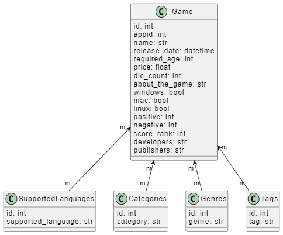

# Segwise Assignment

## Contents

- [Segwise Assignment](#segwise-assignment)
  - [Contents](#contents)
  - [Overview](#overview)
    - [Data Model](#data-model)
  - [Instructions to run the application](#instructions-to-run-the-application)
  - [Deployed Application URL](#deployed-application-url)
  - [Sample API Requests](#sample-api-requests)
    - [Upload a File](#upload-a-file)
      - [Request](#request)
      - [Response](#response)
    - [Query the Database](#query-the-database)
      - [Request](#request-1)
      - [Response](#response-1)
  - [Cost Estimation](#cost-estimation)
    - [Compute Resources](#compute-resources)
    - [Additional Storage Costs](#additional-storage-costs)
    - [Bandwidth Costs](#bandwidth-costs)
    - [Database Costs](#database-costs)
    - [Additional Services](#additional-services)
    - [Summary](#summary)

## Overview

- It is a flask application.
- The uploaded CSV file is parsed and the data is stored in a SQLite database.
- Queries is supported on every field in the database.
- A dockerfile is provided to run the application in a container.
- The application is deployed on Render.

### Data Model




<!-- ```plantuml
@startuml

class Game {
    id: int
    appid: int
    name: str
    release_date: datetime
    required_age: int
    price: float
    dlc_count: int
    about_the_game: str
    windows: bool
    mac: bool
    linux: bool
    positive: int
    negative: int
    score_rank: int
    developers: str
    publishers: str
}

class SupportedLanguages {
    id: int
    supported_language: str
}

class Categories {
    id: int
    category: str
}

class Genres {
    id: int
    genre: str
}

class Tags {
    id: int
    tag: str
}

Game "m" <-- "m" SupportedLanguages
Game "m" <-- "m" Categories
Game "m" <-- "m" Genres
Game "m" <-- "m" Tags

@enduml
``` -->

## Instructions to run the application

1. Clone the repository
2. run `docker build -t segwise .` to build the docker image
3. run `docker run -p 5000:5000 segwise` to run the docker container
4. The application will be running on `http://localhost:5000`


## Deployed Application URL

The application is deployed on Render and can be accessed at the following URL:
https://segwise-latest.onrender.com

## Sample API Requests

### Upload a File

#### Request

    POST
    endpoint - /api/upload_file

    body - form-data
    {
        "file": <file>
    }


#### Response
    {
        "message": "File uploaded successfully",
    }

### Query the Database


#### Request

    GET
    endpoint - /api/query

    query parameters
    {
        "appid": 12140,
        "name": "Max Payne",
        "release_date": "Jan 6, 2011",
        "required_age": 17,
        "price": 3.49,
        "dlc_count": 0,
        "about_the_game": "Max Payne is a",
        "supported_languages": "English",
        "windows": true,
        "mac": false,
        "linux": false,
        "positive": 9516,
        "negative": 1114,
        "score_rank": 0,
        "developers": "Remedy Entertainment",
        "publishers": "Rockstar Games",
        "categories": "Single-player",
        "genres": "Action",
        "tags": "Action,Noir,Classic,Third-Person Shooter,Bullet Time,Story Rich,Atmospheric,Dark"
    }


#### Response
    [
        {
            "about_the_game": "Max Payne is a man with nothing to lose in the violent, cold urban night. A fugitive undercover cop framed for murder, hunted by cops and the mob, Max is a man with his back against the wall, fighting a battle he cannot hope to win. Max Payne is a relentless story-driven game about a man on the edge, fighting to clear his name while struggling to uncover the truth about his slain family amongst a myriad of plot-twists and twisted thugs in the gritty bowels of New York during the century's worst blizzard. The groundbreaking original cinematic action-shooter, Max Payne introduced the concept of Bullet Time® in videogames. Through its stylish slow-motion gunplay combined with a dark and twisted story, Max Payne redefined the action-shooter genre.",
            "appid": 12140,
            "categories": [
                "Single-player"
            ],
            "developers": "Remedy Entertainment",
            "dlc_count": 0,
            "genres": [
                "Action"
            ],
            "linux": false,
            "mac": false,
            "name": "Max Payne",
            "negative": 1114,
            "positive": 9516,
            "price": 3.49,
            "publishers": "Rockstar Games",
            "release_date": "Thu, 06 Jan 2011 00:00:00 GMT",
            "required_age": 17,
            "score_rank": 0,
            "supported_languages": [
                "English"
            ],
            "tags": [
                "Action",
                "Noir",
                "Classic",
                "Third-Person Shooter",
                "Bullet Time",
                "Story Rich",
                "Atmospheric",
                "Dark",
                "Third Person",
                "Singleplayer",
                "Shooter",
                "Great Soundtrack",
                "Detective",
                "Cinematic",
                "Linear",
                "Crime",
                "Violent",
                "Adventure",
                "Horror",
                "Psychological Horror"
            ],
            "windows": true
        }
    ]

## Cost Estimation

### Compute Resources

Using an AWS Lightsail container service plan:

Plan: $7/month (Lightweight container service)

This plan includes 0.25 vCPU, 512 MB RAM, 20 GB SSD storage, and 1 TB of data transfer.

### Additional Storage Costs

Assuming the 20 GB SSD storage included in the Lightsail plan is sufficient for our needs, additional storage costs might be negligible.

Storage cost: $0 (included in the Lightsail plan)

### Bandwidth Costs

The Lightsail plan includes 1 TB of data transfer.

Data transfer for uploads:
    
    150 MB × 30 = 4500 MB ≈ 4.5 GB

Data transfer for uploads:
    
    150 MB × 30 = 4500 MB ≈ 4.5 GB

Total data transfer: 

    4.5 GB (uploads) + 4.5 GB (downloads) = 9000 MB ≈ 9 GB

Since 9 GB is well within the 1 TB limit included in the plan, there are no additional bandwidth costs.

Bandwidth cost: $0 (included in the Lightsail plan)

### Database Costs

If we are to use AWS Lightsail managed database, the smallest plan starts at $15/month.

Database cost: $15/month

### Additional Services

Using AWS CloudWatch for monitoring and logging:

AWS CloudWatch cost: $1/month (minimal usage)

### Summary

Adding these costs together:

| Service | Cost |
| --- | --- |
| Compute resources | $7/month |
| Additional storage | $0/month |
| Bandwidth | $0/month |
| Database | $15/month |
| Additional services | $1/month |
| **Total** | **$23/month** |

So, the estimated cost for running the system in production 24x7 for 30 days on AWS Lightsail containers, assuming one file upload and 100 queries a day, is approximately $23.
